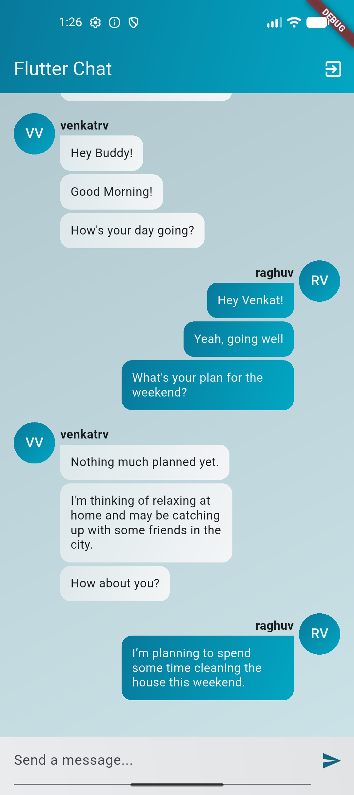
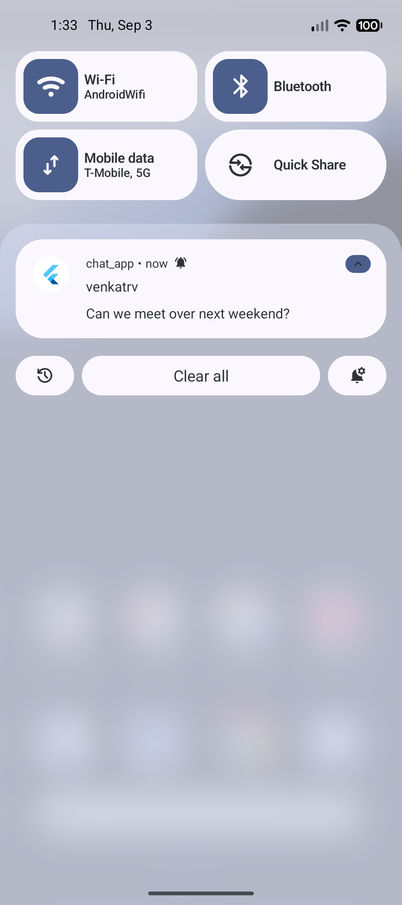
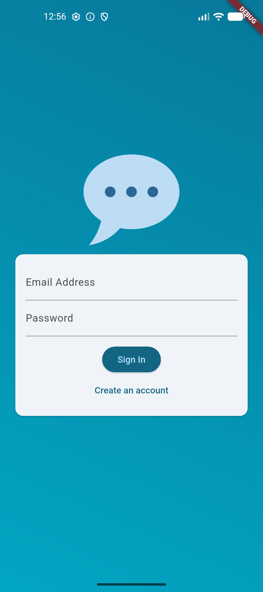
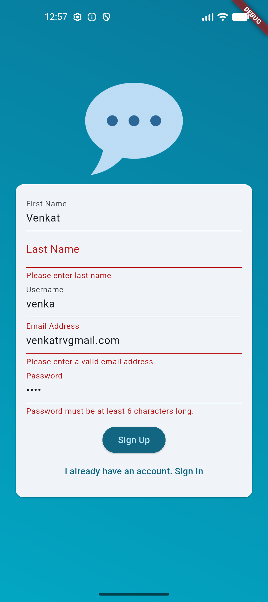

# 💬 Flutter Chat App

A real-time chat application built with **Flutter** and **Firebase**.

The application demonstrates user authentication, real-time messaging using Cloud Firestore, and a clean chat interface with grouped messages and user avatars.

---

## ✨ Features
- 🔐 User registration and login
- 📧 Email & password authentication
- 💬 Real-time chat messaging
- ☁️ Cloud Firestore integration
- 👤 User information stored in Firestore
- 🔄 Real-time message updates
- 🖼️ User avatar support
- 📚 Grouped consecutive messages from the same user
- ↔️ Different message alignment for sender and receiver
- 📱 Flutter-based Android and iOS application

---

## 🛠️ Tech Stack
| Technology | Usage |
|---|---|
| Flutter | Cross-platform UI |
| Dart | Application development |
| Firebase Authentication | User registration and login |
| Cloud Firestore | Real-time message storage |
| Firebase Core | Firebase initialization |

---

## 📸 Screenshots
<table>
  <tr>
    <td>
      <b>Chat Screen</b>
      <br/>
      
    </td>
    <td>
      <b>Push Notification</b>
      <br/>
      
    </td>
  </tr>
  <tr>
    <td>
      <b>Sign In Screen</b>
      <br/>
      
    </td>
    <td>
      <b>Sign Up Screen</b>
      <br/>
      
    </td>
  </tr>
</table>

## 🔥 Firebase Integration
This project uses Firebase for authentication and real-time data storage.

## Firebase Authentication
Users can register and sign in using their email address and password.

## ☁️ Cloud Firestore
User information and chat messages are stored in Cloud Firestore.
Chat messages are stored in the chat collection
Messages are retrieved using a real-time Firestore stream
This allows the chat screen to automatically receive newly added messages without manually refreshing the application.

## 👤 Message Grouping
Consecutive messages from the same user are grouped together.
Instead of displaying the avatar for every message, the application displays the avatar only when a new message sequence begins.

## 🔐 Security
Firebase configuration files contain platform-specific identifiers. Firebase documents these identifiers as non-secret configuration values, but access to Firebase resources should still be protected through appropriate Firebase Authentication and Firestore Security Rules.
Do not commit private credentials, service-account keys, or other secrets to the repository.

---

## 🏗️ Architecture

The application follows a simple Flutter widget-based structure.

```text
chat_app/
│
├── lib/
│   ├── main.dart
│   │
│   ├── screens/
│   │   └── ...
│   │
│   ├── widgets/
│   │   ├── chat_messages.dart
│   │   └── message_bubble.dart
│   │
│   ├── firebase_options.dart
│   └── ...
│
├── android/
├── ios/
├── test/
├── pubspec.yaml
└── README.md

